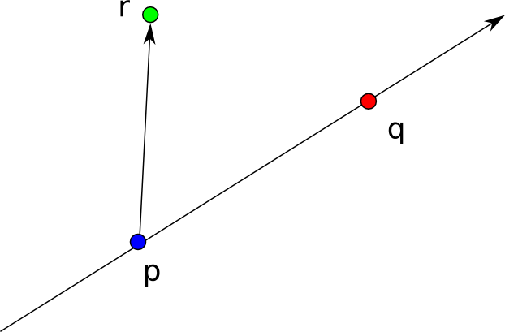
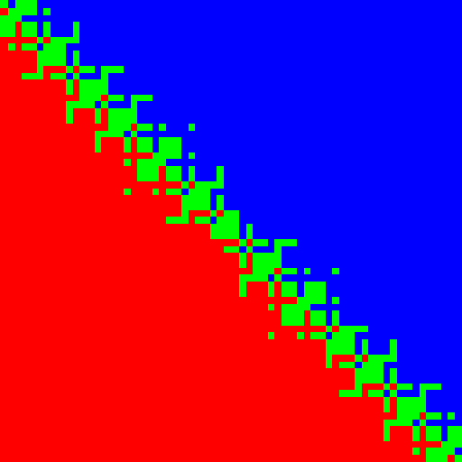

# Robust arithmetic in JavaScript

These notes are adapted from the class lecture notes for CS558, Computational Geometry, which was taught at the University of Wisconsin-Madison in the fall of 2013.

### The real RAM model

In computational geometry, many algorithms are described and analyzed in terms of the [real RAM model](http://en.wikipedia.org/wiki/Blum%E2%80%93Shub%E2%80%93Smale_machine). A real RAM machine is a fictitious sort of computer whose memory cells contain arbitrary [real numbers](http://en.wikipedia.org/wiki/Real_number) and whose operations include ordinary arithmetic (`+, -, *, /` exponentiation, etc.). The real RAM model conceptually simplifies many algorithms and is a useful tool for both teaching and exploring geometric ideas.

But the conceptual advantages of the real RAM model come at a cost. The reason for this is that real numbers are infinite structures and require potentially unlimited memory, while the physical computers that actually exist in nature can only represent finite strings of bits. This mismatch in capabilities creates many challenges in the implementation of geometric algorithms.

### Robustness

A simple strategy for translating a real RAM algorithm into word RAM code is to just replace all of the numbers with approximations, for example using floating point. While this approach has been very successful in the field of numerical methods, in computational geometry it more often runs into problems. Intuitively, the reason for this is that geometric code often needs to make consistent logical decisions based on comparisons between different real numbers. If these comparisons are wrong, the program might produce incorrect output or even crash. To avoid this, great care is needed when implementing a real RAM algorithm. Broadly speaking, implementations of real RAM algorithms can be classified into the following types:

#### Exact algorithms

Exact algorithms are the gold standard for computational geometry.  If an implementation of a real RAM algorithm is exact, then it produces identical output for the same inputs. Of course, not all real RAM algorithms can be implemented exactly, since their output might not be representable (for example, the vertex positions in a [Voronoi diagram](http://en.wikipedia.org/wiki/Voronoi_diagram) are not even rational numbers in general), however for other algorithms which produce purely combinatorial output, like a [Delaunay triangulation](http://en.wikipedia.org/wiki/Delaunay_triangulation) or [convex hull](http://en.wikipedia.org/wiki/Convex_hull), exact results can feasibly be achieved.

#### Robust algorithms

In the cases where exactness may not be possible, the next best solution is robustness.  A robust algorithm is exact for some small perturbation of its inputs.  Taking Voronoi diagrams as example, it might be true that the exact Voronoi diagram is not representable, however if the positions of the input points are moved slightly then the output is correct. 

#### Fragile algorithms

Finally, there are fragile algorithms. Fragile algorithms by definition have bugs since they don't even compute an approximation of the correct real algorithm. Yet, even though fragile algorithms don't always work, they can still be used as long as great care is taken to restrict their inputs to precisely the cases in which they produce acceptable results. While it might be slightly easier to get an initial fragile implementation of an algorithm up and running, correcting and refining them is a grueling and difficult process that does not necessarily converge to a working solution. As a result, it can often save a lot of time and heart ache to spend some more brain power up front in devising an exact or robust solution.

## Why robustness matters

### Example: Left-right test

One of the most basic tasks in computational geometry is to classify wether a point `r` lies to the left or right of an oriented line defined by a pair of points `p` and `q`:  



Naively, one might attempt to implement such a test using a determinant calculation, or [perp product](http://geomalgorithms.com/vector_products.html#2D-Perp-Product), like this:

```javascript
function naiveLeftRight(r, q, p) {
  var prx = p[0] - r[0]
  var pry = p[1] - r[1]
  var qrx = q[0] - r[0]
  var qry = q[1] - r[1]
  return prx * qry - pry * qrx
}
```

The sign of this function would determine whether `r` is to the left or the right of the line `pq`. In an idealized real RAM machine, this algorithm should give the correct result.  One way to understand this visually is to fix the points `p` and `q` and vary the point `r`, and plot the sign of the query as the color of each pixel. For example, we take the points `p` and `q` to be `[12,12]` and `[24,24]` and vary the components of `r` over the interval `[0.5,0.5+Math.pow(2,-42)]`, and color the pixels according to the rule:

```
left   ~>  blue
right  ~>  red
on     ~>  green
```

Then we would expect to get an image that looks something like this:


But if the above JavaScript code is actually executed, the output will instead look like this:



In addition to looking absolutely crazy, the following things are wrong with this picture:

1.  Many points are incorrectly classified as being on the line.
2.  Some points near the boundary are incorrectly classified as being to the left or right of the line.

These small errors near the boundary can have big consequences when they are used as the basis for computational reasoning.  If you want to experiment with this yourself, take a look at the file [orient.js](demos/orient.js) in the demos folder.

### Example: Convex hull

To illustrate one way in which this can go wrong, consider the problem of finding the convex hull of a set of points. One simple algorithm for doing this is to use incremental insertion.  In JavaScript, this might be done like this:

```javascript
function incrementalConvexHull(points, leftRight) {
  //Construct initial hull
  var hull = points.slice(0, 3)
  if(leftRight(hull[0], hull[1], hull[2]) < 0) {
    hull[0] = points[1]
    hull[1] = points[0]
  }

  //Insert points into the hull
  for(var i=3; i<points.length; ++i) {
    var r = points[i]

    //Scan through points to find edges visible from r
    var start = -1, stop = -1, n=hull.length
    var prev = leftRight(r, hull[n-2], hull[n-1]) >= 0
    for(var j=0,k=n-1; j<n; k=j++) {
      var cur = leftRight(r, hull[k], hull[j]) >= 0
      if(!cur && prev) {
        start = j
        if(stop >= 0) { break }
      }
      if(cur && !prev) {
        stop = k
        if(start >= 0) { break }
      }
      prev = cur
    }

    //If point inside hull, skip it
    if(start < 0) {
      continue
    }

    //Otherwise, insert point into hull
    if(start <= stop) {
      hull.splice(start, stop - start, r)
    } else {
      hull.splice(start, hull.length-start, r)
      hull.splice(0, stop)
    }
  }

  return hull
}
```

Now suppose that we run this algorithm with the following list of points (originally constructed by Kettner et al.):

```javascript
[ [24.00000000000005, 24.000000000000053],
  [54.85, 6],
  [24.000000000000068, 24.000000000000071],
  [54.850000000000357, 61.000000000000121],
  [24, 6],
  [6, 6] ]
```

We would expect the output from this process to look something like this:


Instead though, if we use the fragile left right test described above, the output will look like this:


Incredibly, the resulting polygon isn't even convex!  The moral of the story is that even small errors in computational geometry can have *big* consequences.  If you want to test this out yourself, take a look the [hull.js](demos/hull.js) file in the demos folder.

## Numbers in the word RAM

To better understand what goes wrong with robustness, we will review a few of the common representations for real numbers that are used in computers.

### Integers

The default data type in the word RAM model, and generally in any computer, is [finite size integer](http://en.wikipedia.org/wiki/Word_(computer_architecture)).  These integers are encoded as bit strings of length `n` and can represent any number from `0` to `2^n - 1`, or `-2^(n-1)` to `2^(n-1) - 1` using [two's complement](http://en.wikipedia.org/wiki/Two's_complement). Excluding overflow, arithmetic on integers is exact, however it has the disadvantage that fractional numbers cannot be represented.

### Fixed point

[Fixed point numbers](http://en.wikipedia.org/wiki/Fixed-point_arithmetic) provide an efficient solution to this problem.  Binary fixed point numbers work much like [decimal notation](http://en.wikipedia.org/wiki/Decimal_mark) for writing a fraction.  The general idea is that we take any integer, and split its bits into two parts: those bits which are after the "decimal point" and those that come before it.  For example, the number `1.5` can be encoded in a 8-bit binary fixed point with the decimal point the 4th bit as follows:

```
0 0 0 1 . 1 0 0 0  = 1.5
```

Or, another way to think about a fixed point number is that it is an integer multiplied by a fractional power of two.  For example, the above fixed point number could be thought of as:

```
1.5 = 0 0 0 1 . 1 0 0 0 = 0x18 * 2^-4
```

The nice thing about fixed point numbers is that integer arithmetic operations translate directly into arithmetic on fixed point numbers combined with shifting. For example, the product of two fixed point numbers can be written as their integer product shifted right by the decimal point.

```
(a * 2^-p) * (b * 2^-p) = a * b * 2^-2p = (a * b * 2^-p) * 2^-p
```

### Floating point

Fixed point is a fast way to encode fractions, but it has the problem that it can't easily represent very large or very small numbers.  The solution to this is to use [scientific notation](http://en.wikipedia.org/wiki/Scientific_notation), which allows the position of the decimal mark to change. [Floating point numbers](http://en.wikipedia.org/wiki/Floating_point) are the application of scientific notation to binary numbers. Today, floating point numbers are standardized by the [IEEE](http://en.wikipedia.org/wiki/IEEE_floating_point), and most computers have special hardware optimizations to support it.

A floating point number consists of 3 parts:

* The *significand*
* The *exponent*
* And the *sign bit*

And the float encodes a rational number of the form:

```
-1^sign * significand * 2^exponent
```

However, the number of bits reserved for the significand in a floating point number is finite, and so arithmetic on floats of different magnitudes requires rounding.

## How do we implement robust algorithms?

### Rationals and big numbers

### Symbolic computations and radicals

### Constructions vs. Predicates


## Implementing predicates

### Non-overlapping sequences

### Addition

### Multiplication

### Homogeneous coordinates

### Adaptivity


## Writing robust code in JavaScript


## References

[1] L. Kettner, K. Mehlhorn, S. Pion, S. Schirra, C. Yap. "[Classroom examples of robustness problems in geometric computations](http://people.mpi-inf.mpg.de/~kettner/pub/nonrobust_esa_04.pdf)" ESA 2004

[2] J. Shewchuk. "[Lecture notes on robustness](http://www.cs.berkeley.edu/~jrs/meshpapers/robnotes.pdf)" 2013